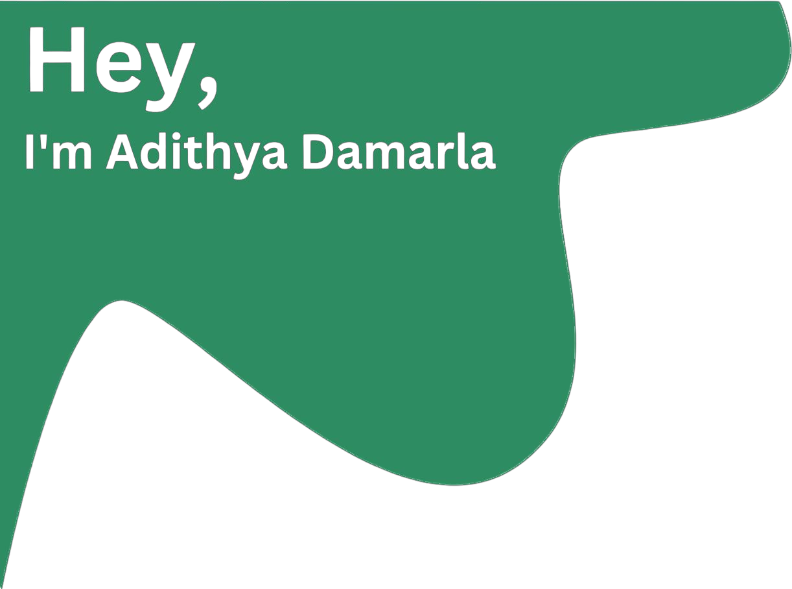
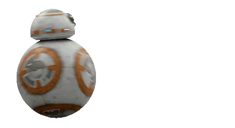
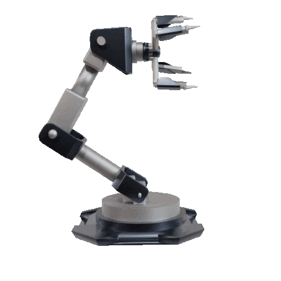
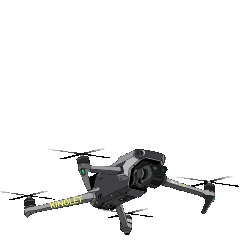

# About Me:
I'm currently working on innovative robotics projects, focusing on advanced control systems. I'm looking to collaborate on cutting-edge robotics applications and research. I'm seeking help with expanding my knowledge in emerging robotics technologies. I'm currently learning about the latest advancements in robotics and control systems. Ask me about my journey as a dedicated Robotics Engineer with over two years of experience, my proficiency in various tools and technologies.

## 🌐 Socials:
 

# 💻 Tech Stack:
           

## 🏭 Industrial Knowledge: 

- Non-Linear Mechanical Control Systems, Control of Electrical Machines, Robot Mechanics, Sensor integration, Sensor Fusion, Internet of Things, Digital Electronics, Analogue Electronics, Pneumatics, Electro Pneumatics, P.L.C (Designing using ladder logic), Hydraulics, Power Electronics and Electrical Drives, Strength of Materials. 

## 💻 Programming:
- C 
- C++ 
- Python 
- Java 

## 🖥️ Operating Systems: 

- Linux
- ROS 
- ROS 2
- mirco-ROS
- WSL2 G 

## 🔌 Embedded Boards: 

    - Arduino
    - Particle Photon
    - MYRio
    - STM32
    - Raspberry PI
    - Node MCU
    - ESP32
    - Bosch Rexroth (RC 12-10/30)

## 📡 Communication Protocols: 

- CAN bus  
- UART
- SPI
- RS 232
- J1939
- CAN calibration Protocols (CCP)

# 📊 GitHub Stats:

  

### ✍️ Random Dev Quote

### 🔝 Top Contributed Repo

---

<!-- Proudly created with GPRM ( https://gprm.itsvg.in ) -->

<picture>
  <source media="(prefers-color-scheme: dark)" srcset="https://raw.githubusercontent.com/AdithyaDamarla/AdithyaDamarla/output/github-snake-dark.svg" />
  <source media="(prefers-color-scheme: light)" srcset="https://raw.githubusercontent.com/AdithyaDamarla/AdithyaDamarla/output/github-snake.svg" />
  
</picture>
